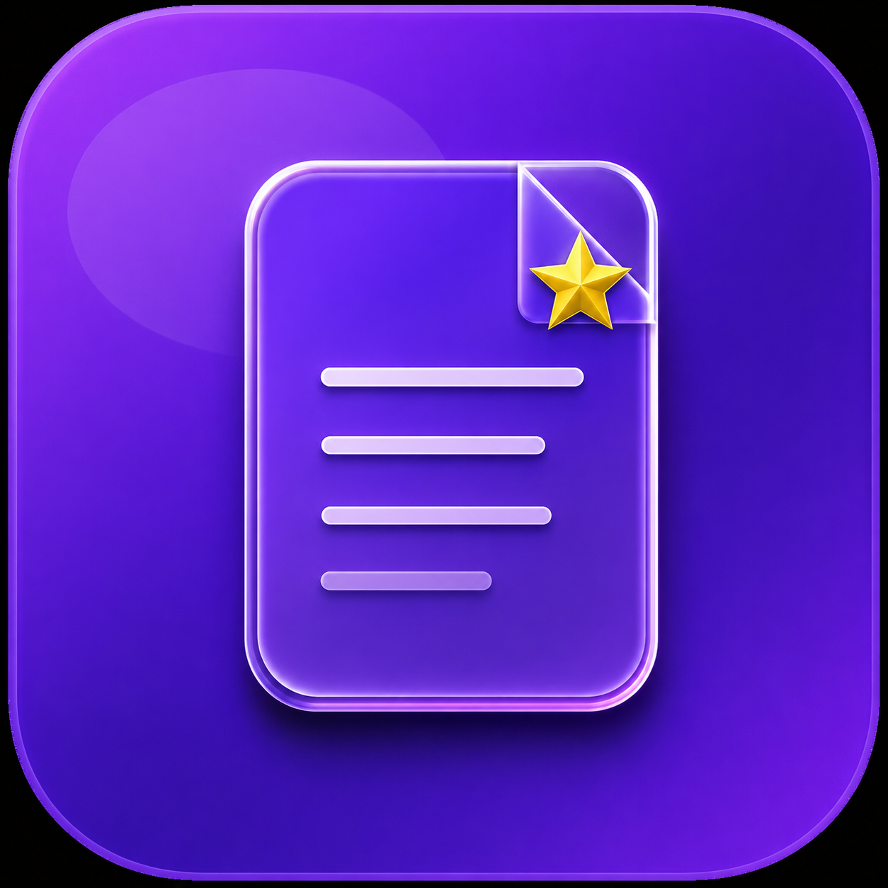

# resume_maker

A new Flutter project.

## Getting Started
# Pro Resume Maker & CV Builder

<p align="center">
  
</p>

<p align="center">
  <a href="https://play.google.com/store/apps/details?id=com.shubham.proresumemakerapp">
    
  </a>
  
  
  
  
  
</p>

<p align="center">
  A production-grade Flutter application for building, previewing, and exporting professional resumes as ATS-optimized PDF documents. Published on Google Play Store.
</p>

---

## 📱 Live on Google Play Store

> **[Download Pro Resume Maker](https://play.google.com/store/apps/details?id=com.shubham.proresumemakerapp)**

---

## ✨ Features

### Core Functionality
- **Multi-Resume Management** — Create, edit, duplicate, and delete unlimited resumes
- **9 Professional PDF Templates** — ATS-optimized designs for all career stages
- **Real-time PDF Preview** — Live preview updates as you edit content
- **One-tap PDF Export** — Download, share, print, or copy as plain text
- **Signature Support** — Draw with finger/stylus or upload from gallery
- **Section Reordering** — Drag-and-drop to customize resume layout
- **Custom Sections** — Add any section beyond the defaults

### Resume Sections
Personal Details · Professional Summary · Work Experience · Education · Skills · Projects · Languages · Certifications · References · Signature · Additional Information

### PDF Templates
| Template | Style | Best For |
|---|---|---|
| Classic Pro | Single-column, ATS-safe | All corporate roles |
| Clean ATS Pro | Plain, maximum ATS compatibility | IT, MNC applications |
| Modern Blue | Bold header, two-tone | Tech, creative roles |
| Executive | Black & gold accent | Senior positions |
| Sidebar Dark | Two-column, dark panel | Design, creative |
| Emerald Split | Green accent, split layout | Healthcare, education |
| Slate Column | Two-col, slate sidebar | Finance, consulting |
| Crimson Edge | Left accent bar, bold name | Sales, marketing |
| Navy Timeline | Timeline dots, navy | Project managers |

### Smart UX
- **Currently Working Here** toggle — automatically sets end date to "Present"
- **ATS Score Badge** — real-time ATS-readiness indicators on templates
- **Daily Reminders** — 44 unique motivational notifications, random time 9AM–8PM
- **In-app Review Prompt** — non-intrusive rating flow via `in_app_review`
- **Data Persistence** — all resume data stored locally via `SharedPreferences`

### Ad Integration
- Google AdMob banner ads with frequency-capped interstitial (rewarded before PDF export)
- Smart ad frequency manager — random threshold (2–4 actions) before interstitial shows

---

## 🏗️ Architecture & Tech Stack

```
lib/
├── main.dart                    # App entry, service initialization
├── app_constants.dart           # Centralized colors, URLs, strings
├── resume_data.dart             # Singleton data model + SharedPreferences persistence
├── ad_helper.dart               # AdMob banner + interstitial manager
├── notification_service.dart    # Local notifications with shuffle rotation
├── home_screen.dart             # Resume dashboard (list, create, edit, delete)
├── editor_dashboard.dart        # Section editor with unsaved-changes guard
├── pdf_preview_screen.dart      # 9-template PDF renderer + export actions
├── personal_details.dart        # Personal info form
├── objective_screen.dart        # Professional summary editor
├── experience_screen.dart       # Work experience CRUD + date picker
├── education_screen.dart        # Education CRUD + year range picker
├── skills_screen.dart           # Skills list editor
├── project_screen.dart          # Projects CRUD
├── reference_screen.dart        # References CRUD
├── languages_screen.dart        # Languages editor
├── signature_screen.dart        # Draw (canvas) + Upload signature tabs
├── manage_section_screen.dart   # Section toggle + reorder
├── rearrange_screen.dart        # Drag-and-drop section ordering
├── profile_screen.dart          # Settings, legal links, reminders toggle
└── notification_service.dart    # Timezone-aware daily notifications
```

### Key Design Decisions
- **Singleton `ResumeData`** — single source of truth, no state management library overhead
- **Fault-isolated services** — notification, ads, and PDF generation never affect core app flow
- **`if (mounted)` guards** — all async `setState` calls checked before execution
- **Unicode sanitization** — `_clean()` strips emoji, dashes, and special chars before PDF rendering (Helvetica font safety)
- **Fisher-Yates shuffle** — notification messages rotate through all 44 before repeating

---

## 🛠️ Tech Stack

| Category | Technology |
|---|---|
| Framework | Flutter 3.x / Dart 3.0+ |
| PDF Generation | `pdf ^3.11.3` + `printing ^5.14.2` |
| Ads | Google AdMob (`google_mobile_ads ^8.0.0`) |
| Notifications | `flutter_local_notifications ^18.0.1` |
| Timezone | `flutter_timezone ^1.0.4` + `timezone ^0.9.4` |
| Storage | `shared_preferences ^2.5.4` |
| Image | `image_picker ^1.2.1` |
| Signature | `signature ^6.3.0` |
| URL Handling | `url_launcher ^6.2.5` |
| Review | `in_app_review ^2.0.9` |
| Min SDK | Android 21 (Android 5.0+) |
| Target SDK | Android 34 |

---

## 🚀 Getting Started

### Prerequisites
- Flutter SDK `>=3.0.0`
- Android Studio / VS Code with Flutter extension
- Android device or emulator (API 21+)

### Installation

```bash
# Clone the repository
git clone https://github.com/shubh962/Pro-Resume-Maker.git
cd Pro-Resume-Maker

# Install dependencies
flutter pub get

# Generate app icons and splash screen
dart run flutter_launcher_icons
dart run flutter_native_splash:create

# Run in debug mode
flutter run
```

### Release Build

```bash
flutter build appbundle --release
```

Output: `build/app/outputs/bundle/release/app-release.aab`

> **Note:** Release builds require a `key.properties` file and keystore. See [Flutter docs on signing](https://docs.flutter.dev/deployment/android#signing-the-app).

---

## 📦 Project Stats

| Metric | Value |
|---|---|
| Total Dart files | 25 |
| Lines of code | ~5,900 |
| PDF templates | 9 |
| Notification messages | 44 |
| Min Android SDK | API 21 |
| Play Store status | Live ✅ |

---

## 🔔 Notification System

Daily reminders use a **timezone-aware, fault-isolated** notification service:

- `flutter_timezone` fetches the device's IANA timezone (`Asia/Kolkata`, `America/New_York`, etc.)
- Random fire time between **9 AM – 8 PM in the user's local timezone**
- 44 unique messages rotated via Fisher-Yates shuffle — no repeats until full cycle completes
- Persists across device reboots via `ScheduledNotificationBootReceiver`
- Uses `inexactAllowWhileIdle` — Play Store compliant, no exact alarm declaration needed

---

## 🗺️ Roadmap

### V2 (Planned — post 10K downloads)
- [ ] Google Gemini AI integration — paste job description, get tailored resume suggestions
- [ ] ATS match score per job description
- [ ] Cloud backup via Google Drive
- [ ] Multi-language resume support (Hindi, Arabic, Spanish, French +10 more)
- [ ] Dark mode
- [ ] Premium plan via Google Play Billing
- [ ] Cover letter builder

### Principles for V2
- AI layer fully fault-isolated — failures never affect core resume functionality
- All external service failures handled with graceful UI fallback
- Static analysis gate (`flutter analyze`) before every release

---

## 📄 Legal

- [Privacy Policy](https://shubh962.github.io/Resumelegal/privacy-policy.html)
- [Terms of Service](https://shubh962.github.io/Resumelegal/terms.html)
- [About](https://shubh962.github.io/Resumelegal/about.html)

---

## 👨‍💻 Author

**Shubham Gautam**

[](https://github.com/shubh962)
[](https://www.linkedin.com/in/Shubh962)
[](https://play.google.com/store/apps/details?id=com.shubham.proresumemakerapp)

---

## ⭐ Support

If this project helped you, consider leaving a **star** on GitHub and a **review** on the Play Store — it helps more developers find the app.

---

<p align="center">Built with ❤️ using Flutter · Published on Google Play Store</p>
This project is a starting point for a Flutter application.

A few resources to get you started if this is your first Flutter project:

- [Lab: Write your first Flutter app](https://docs.flutter.dev/get-started/codelab)
- [Cookbook: Useful Flutter samples](https://docs.flutter.dev/cookbook)

For help getting started with Flutter development, view the
[online documentation](https://docs.flutter.dev/), which offers tutorials,
samples, guidance on mobile development, and a full API reference.
